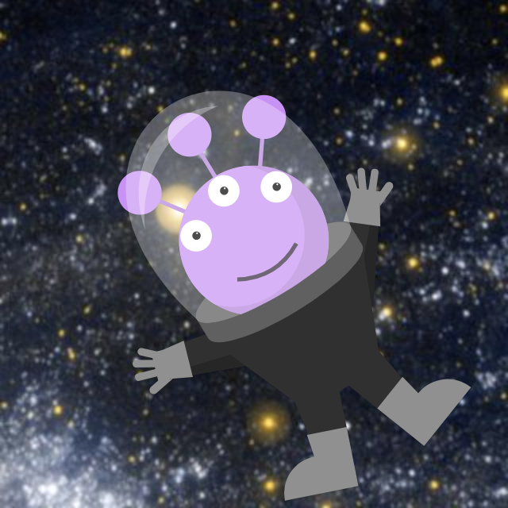

# spacicon: Procedurally generated space-themed avatars

>**Note**: This is a just-for-fun-project, made for no other reasons than me obviously having nothing better to do.

spacicon is a small, Python-based web service that serves procedurally generated, space- and alien-themed avatars.

## Examples

## Docker quickstart

Quick and easy:

    $ docker run -d --name spacicon -p 80:5000 quay.io/martinhelmich/spacicon

With Redis caching:

    $ docker run -d --name spacicon-redis redis
    $ docker run -d --name spacicon -p 80:5000 --link redis:redis -e CACHE_TYPE=redis -e CACHE_REDIS_URL=redis://redis:6379/1 quay.io/martinhelmich/spacicon

## Usage

Get a procedurally generated profile image for a specific user:

    $ curl http://localhost/profile/<userid>.png

A `<userid>` value might be anything that uniquely identifies a user in your application, like for example an user ID, an email address, or (if privacy is a concern) the hash of a user's email address.

You can also generate a profile image for an entire team of users:

    $ curl http://localhost/team/<teamid>.png?user=<userid-1>&user=<userid-2>&...

In all requests, you can substitute the `.png` suffix with `.svg` to receive vector instead of raster graphics.

## Credits

The background images are public domain images by NASA/JPL-Caltech.
